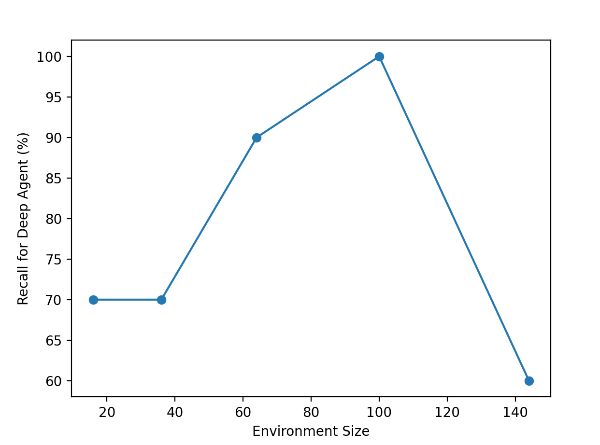

# Policy Reusability in Reinforcement Learning

## Table of Contents
- [Introduction](#introduction)
- [Project Structure](#project-structure)
- [Getting Started](#getting-started)
- [Prerequisites](#prerequisites)
- [Installation](#installation)
- [Example](#example)

## Introduction
Training different policies in Reinforcement Learning is highly useful but time consuming. Assume there is a RL agent in an environment that has learnt a set of policies (R1, R2, ...), and we aim to learn a new policy R_new that is a linear combination of the previous ones. (For example: R_new = R1 + R2 + ...). We have designed and implemented an algorithm to learn this new policy without any new training process. We have done several different experiments that prove our proposed method works both correctly and efficiently. 

We have implemented two different use cases for this algorithm. The first one is called "Grid World", which is a grid with an agent that has specific set of actions, and aims to reach a goal. The other use case is named "Query Refinement". In this use case, we have a goal/reference review, and we interact with LLM of OpenAI to modify the user's query step by step so that it finally reaches the goal, and it basically means being close enough to the reference review in terms of meaning. For both use cases, we have defined different reward policies so that we can combine them and test if we can learn the combined policy without training the agent again and by only using the already trained policies. 

## Project Structure
This project has been implemented in a modular structure, and the RL agents have been defined once to be used for the both use cases. The python files serve different goals in the project, and the generated CSV files are the results of the implemented tests. Here is a high-level overview of the different parts/files of the project:

- The agents folder consists of the QLearning and Deep Agents. 

- The env folder has two important files: 
"gridworld.py" and "query_refine.py"
These two files are basically the environments of our two use cases. We have used/inherited Environment of "Gym" library to define all the details of our use cases over that. 
The other files in the env folder serve different functionalities. For example, connecting to the database to get amazon reviews, connecting to OpenAI LLM to interact  with gpt-3.5 for the query-refine use case, generating random policies, embedding text to vector and compute cosine similarity between vectors. 

- Python files starting with the word "train_" are basically the implementation of the train process of different agents for the two use cases. 

- Files having a "npy" extension are just the Q-Tables of the training instances stored after the training was done. 

- "pkl" extension files are also trained deep agents that have been stored. 

- Python files starting with "inference_" are used to implement the inference phase of an agent. They are helpful since we can use them to make sure an agent has been trained properly.

- Python files starting with "heuristic" are the implementation of the "greedy-k" algorithm. One of the proposed methods in our research work. 

- Python files starting with "DAG" represent the DAG data structure that we use as a core concept in our proposed algorithm. For each instance of training a DAG is also created that consists of all the transitions occured during the training. The corresponding DAGs of different training instances are unioned together to get a final DAG on which our pruning algorithm is based on.

- Pyhton files starting with "pruning" contain our core pruning algorithm called "ExNonZeroDiscount". 

- Python files starting with "test_" are all the the experiments that we have performed on the two use cases for different scenarios. These are the files that we can run.

- "utilities.py" is a unique file containing a set of functions to plot different experiment results based on their csv files. 

## Getting Started
To run this project, you need to have Python3 installed (Preferrebly Python3.9 or higher versions). Also, you need to have some libraries installed using "pip install" command. 

The files containing the "test" word in the beginning are the experiments of the project. You can run any of them to see their corresponding results. After you run a test file, some information might be printed about the execution process in the terminal. When the test is done, a csv file including the test results is created in the root directory of the project. Also, a window pops up which plots the resulting graphs of the experiment if applicable. 

Also, since the Query Refinement use case uses amazon reviews, we have stored a subset of reviews of the whole amazon dataset reviews in a csv file, and we read from that csv file in the code. However, if one wants to get the whole dataset and work on that, must have PostgreSQL installed, load "amazon reviews" dataset in their PostreSQL server, and also delete the "review.csv" file. Because if this file exists, the code will not read from the database, but if it doesn't, our code will get the reviews from the amazon database. You can also specify more details about that (number of desired reviews, etc) in the code.

Finally, as another optional step, if you want to have some of the generated figures stored on an online environment, you can create an account on WandB website, and use "wandb login" command in your terminal to login to your account. Then, you can uncomment the lines of the code that are related to WandB so that the figures get stored on your WandB account. 

### Prerequisites
- Python 3.x (Preferrebly 3.9 or higher)
- (Optional) PostgreSQL 
- (Optional) Load Amazon reviews dataset in PostgreSQL. Here is the link to the amazon reviews dataset:
    - https://www.dropbox.com/s/j04z1gx4tt51q20/intex_amazon.backup?dl=0
    - The daabase must be called "amazon_reviews"
- The following python libraries using "pip install":
    - networkx
    - matplotlib
    - numpy
    - torch
    - stable-baselines3
    - pandas
    - transformers
    - scikit-learn
    - gym
    - wandb 
    - psycopg2
    - psutil

### Installation

1. Clone the repository:
<pre>
<code>
    git clone https://github.com/PolicyReusablityInRL/Policy-Reusablity.git
</code>
</pre>
2. Install the following libraries using pip:
<pre>
<code>
    pip install matplotlib
    pip install numpy
    pip install torch
    pip install pandas
    pip install transformers
    pip install stable-baselines3
    pip install scikit-learn
    pip install gym
    pip install wandb
    pip install psycopg2
    pip install networkx
    pip install psutil
</code>
</pre>
3. **(Optional)** Setup the database if you want to work on more reviews as explained in the previous section.

4. **(Optional)**: if you want to have some figures/plots stored on an online envrionment, you can create a [WandB account](https://wandb.ai/site), login to your account using terminal and uncomment any wandb commands in the code that you want to execute and store their corresponding figures. Here is the command you need to run in your terminal after you create an account on WandB website:
<pre>
<code>
    wandb login
</code>
</pre>

5. Run any test file that you want to see its results. A test file's name starts with "test_". Before you run a test file, you can search "#input" in the file, and then you will see the already default parameters set to some values. You can change these input parameters. These are the setting parameters of the tests (For example number of different test cases, etc). 

### Example

After the setup process is all done, we can run a sample test file like "test_recall_deep.py". 

First we can modify the input parameters if we want (not necessary):

After running the file, here is the generated output Figure and CSV file:

